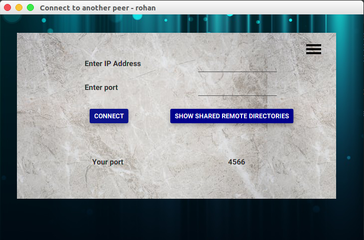
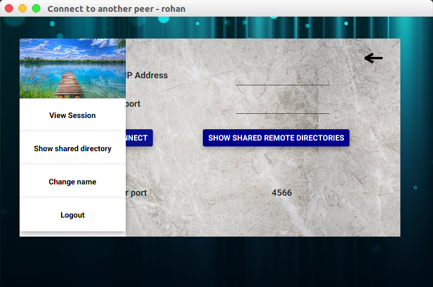
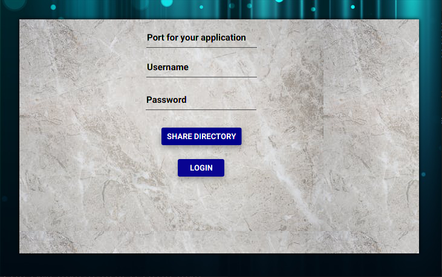
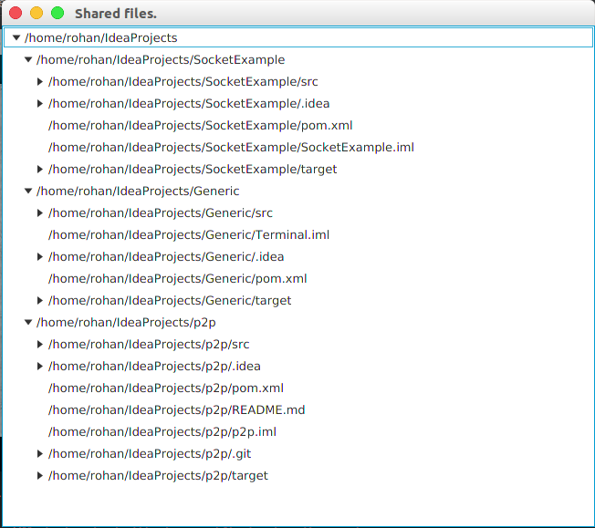
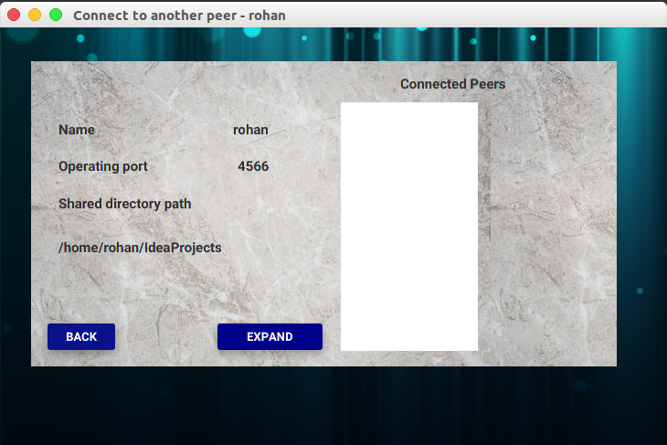

# P2P

P2P is a project which aims to share files over a peer to peer network. User logs into the system and specifies a directory that can be shared amongst other peers.

## Build and Installation

To build the project, migrate to the root project of the directory and type the following command.

> **mvn** install

## Specialities

The project uses JavaFX to achieve its purpose. This framework facilitates the implementation of a good graphical user interface (GUI). This is demonstrated with the help of screenshots.

## Screenshots

